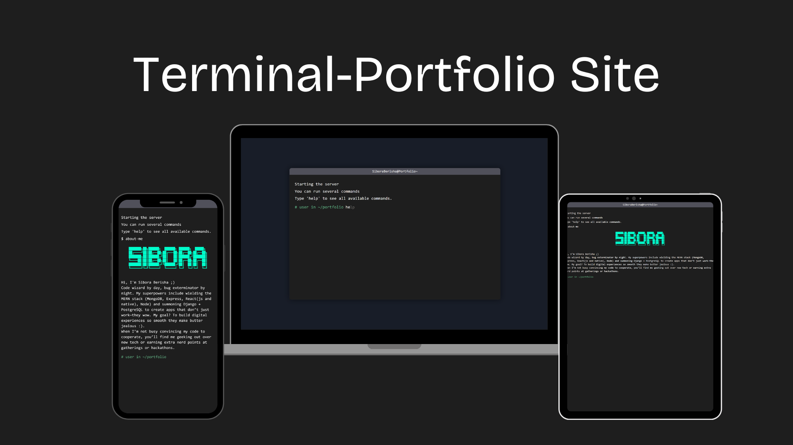

## Terminal Portfolio

A interactive portfolio website designed to look like a terminal, complete with commands, projects, and a hidden Snake game!  



## Features

 Type commands to navigate the portfolio:
  - `help` - Show all commands
  - `about-me` - Developer introduction
  - `projects` - List of deployed projects
  - `skills` - Technical expertise
  - `contact` - Email and social links
  - `clear` - Reset the terminal
  - `snake` - 🐍 Secret Snake game!

- **Snake Game Easter Egg**  
  - Classic Snake gameplay with arrow keys
  - Mobile-responsive with touch controls
  - Score tracking and collision detection

- **Terminal Enhancements**  
  - Command history (↑/↓ arrows)
  - Autocomplete suggestions (Tab key)
  - URL/email hyperlink detection


## Technologies Used

- HTML/CSS
- Vanilla JavaScript
- Canvas API (for Snake game)


## Installation

1. Clone the repository:
```bash
git clone https://github.com/siboraberishaa/portfolio.git
```

2. Open `index.html` in your browser

Or simply host the files on any web server.

## Browser Support

- Chrome (recommended)
- Firefox
- Safari
- Edge


## Contributing

Feel free to submit issues and enhancement requests!

## License

This project is licensed under the MIT License
